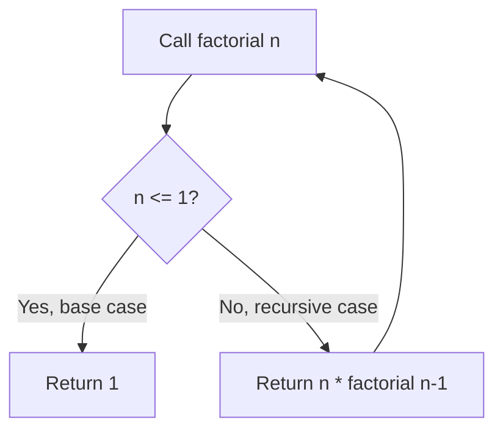
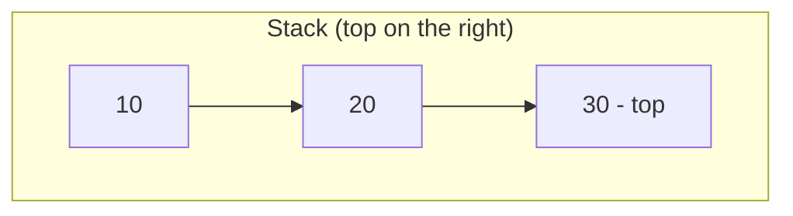
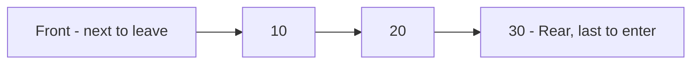
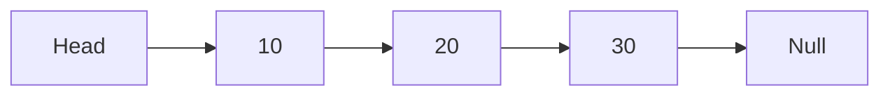
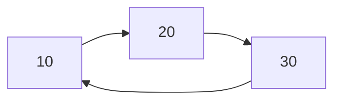
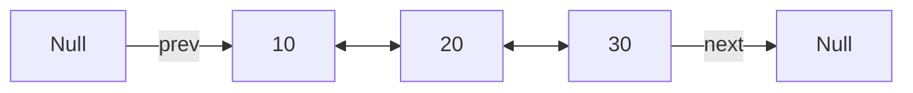
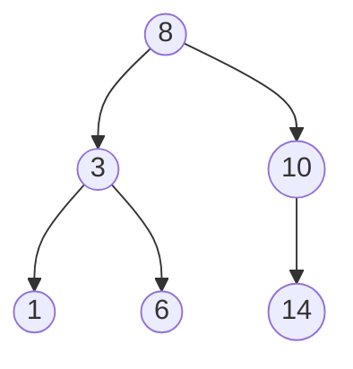
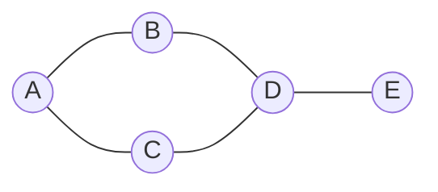
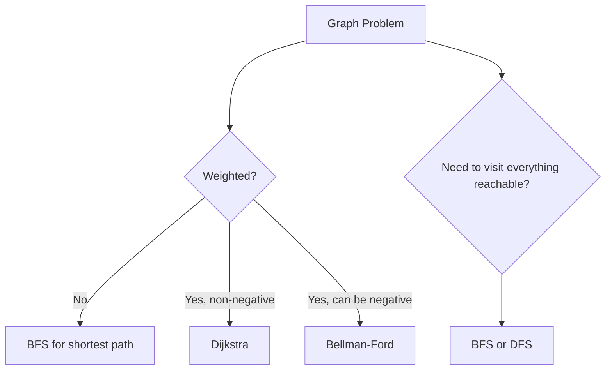

# 1. Introduction to Recursion

## 1.1 Definition of Recursion, Algorithms, and Programs

**Algorithm**: a finite, well-defined sequence of steps that solves a problem or performs a computation. An algorithm doesn't depend on a specific programming language — it's the *idea* behind the solution.

**Program**: the concrete implementation of an algorithm in a specific programming language, ready to be compiled/interpreted and executed.

**Recursion**: a technique where a function **calls itself** to solve smaller instances of the same problem, until it reaches a case simple enough to solve directly.

Every correct recursive solution needs two parts:

1. **Base case** — the condition that stops the recursion (without it, the function calls itself forever and crashes with a stack overflow).
2. **Recursive case** — where the function calls itself with a "smaller" version of the problem, moving toward the base case.



### Classic example — Factorial

Mathematically: `n! = n * (n-1) * (n-2) * ... * 1`, and `0! = 1`.

**Python**

```python
def factorial(n):
    if n <= 1:          # base case
        return 1
    return n * factorial(n - 1)   # recursive case

print(factorial(5))  # 120
```

**Java**

```java
public static int factorial(int n) {
    if (n <= 1) {           // base case
        return 1;
    }
    return n * factorial(n - 1);   // recursive case
}
```

### How the call stack works

Each recursive call is pushed onto the **call stack**, and only starts "returning" once the base case is hit. For `factorial(3)`:

```text
factorial(3)
  -> 3 * factorial(2)
        -> 2 * factorial(1)
              -> 1 (base case)
        <- 2 * 1 = 2
  <- 3 * 2 = 6
```

This is exactly why recursion connects so directly with the **stack** data structure covered later in this guide — recursion *is*, under the hood, a stack of pending calls.

---

## 1.2 Counting (Recursive Counting Problems)

"Counting" recursion refers to problems where the recursive call accumulates a numeric result — sums, counts, powers, Fibonacci, etc.

### Sum of the first N natural numbers

**Python**

```python
def sum_up_to(n):
    if n == 0:
        return 0
    return n + sum_up_to(n - 1)

print(sum_up_to(5))  # 15
```

**Java**

```java
public static int sumUpTo(int n) {
    if (n == 0) {
        return 0;
    }
    return n + sumUpTo(n - 1);
}
```

### Power (exponentiation)

**Python**

```python
def power(base, exponent):
    if exponent == 0:
        return 1
    return base * power(base, exponent - 1)

print(power(2, 5))  # 32
```

**Java**

```java
public static int power(int base, int exponent) {
    if (exponent == 0) {
        return 1;
    }
    return base * power(base, exponent - 1);
}
```

### Fibonacci

A good example of a recursive definition with **two** recursive calls.

**Python**

```python
def fibonacci(n):
    if n <= 1:
        return n
    return fibonacci(n - 1) + fibonacci(n - 2)

print(fibonacci(6))  # 8
```

**Java**

```java
public static int fibonacci(int n) {
    if (n <= 1) {
        return n;
    }
    return fibonacci(n - 1) + fibonacci(n - 2);
}
```

📌 Naive Fibonacci recomputes the same values many times (exponential time complexity). This is usually the entry point to talk about **memoization** — caching results of subproblems to avoid recomputation.

**Python with memoization**

```python
def fibonacci_memo(n, cache={}):
    if n in cache:
        return cache[n]
    if n <= 1:
        return n
    cache[n] = fibonacci_memo(n - 1, cache) + fibonacci_memo(n - 2, cache)
    return cache[n]
```

---

## 1.3 Recursive Processing of Lists

Recursion is a natural fit for structures that are themselves defined recursively — a list is "an element followed by the rest of the list", which mirrors the base case / recursive case pattern perfectly.

### Sum of elements in a list

**Python**

```python
def sum_list(lst):
    if not lst:                 # base case: empty list
        return 0
    return lst[0] + sum_list(lst[1:])   # first element + rest of the list

print(sum_list([1, 2, 3, 4]))  # 10
```

**Java** (using an array with an index instead of slicing, since Java arrays don't support easy slicing)

```java
public static int sumList(int[] arr, int index) {
    if (index == arr.length) {   // base case: reached the end
        return 0;
    }
    return arr[index] + sumList(arr, index + 1);
}

// call it as: sumList(numbers, 0)
```

### Finding the maximum value recursively

**Python**

```python
def find_max(lst):
    if len(lst) == 1:
        return lst[0]
    rest_max = find_max(lst[1:])
    return lst[0] if lst[0] > rest_max else rest_max
```

**Java**

```java
public static int findMax(int[] arr, int index) {
    if (index == arr.length - 1) {
        return arr[index];
    }
    int restMax = findMax(arr, index + 1);
    return arr[index] > restMax ? arr[index] : restMax;
}
```

### Reversing a list recursively

**Python**

```python
def reverse_list(lst):
    if len(lst) <= 1:
        return lst
    return reverse_list(lst[1:]) + [lst[0]]

print(reverse_list([1, 2, 3]))  # [3, 2, 1]
```

**Java** (reversing an ArrayList recursively)

```java
public static void reverseList(List<Integer> list, int index) {
    if (index >= list.size() / 2) {
        return;
    }
    int temp = list.get(index);
    list.set(index, list.get(list.size() - 1 - index));
    list.set(list.size() - 1 - index, temp);
    reverseList(list, index + 1);
}
```

---

## 1.4 Removing Recursion (Converting to Iteration)

Every recursive algorithm can be rewritten iteratively — usually by manually managing an explicit **stack** to replace the implicit call stack, or by using loop variables to track state.

### Factorial: recursive vs iterative

**Python — recursive**

```python
def factorial_recursive(n):
    if n <= 1:
        return 1
    return n * factorial_recursive(n - 1)
```

**Python — iterative**

```python
def factorial_iterative(n):
    result = 1
    for i in range(2, n + 1):
        result *= i
    return result
```

**Java — iterative**

```java
public static int factorialIterative(int n) {
    int result = 1;
    for (int i = 2; i <= n; i++) {
        result *= i;
    }
    return result;
}
```

### Simulating recursion with an explicit stack

When a recursive algorithm is complex (e.g. tree traversal), it can be converted to an iterative version using a manual stack — this is exactly what the JVM/interpreter does internally with the call stack.

**Python — iterative factorial using an explicit stack (illustrative)**

```python
def factorial_with_stack(n):
    stack = []
    while n > 1:
        stack.append(n)
        n -= 1

    result = 1
    while stack:
        result *= stack.pop()
    return result
```

### Why remove recursion?

* Avoids **stack overflow** on deep recursion (many languages have a limited call-stack depth).
* Can be more **memory-efficient** — no overhead of function-call frames.
* Sometimes **faster**, since function calls have overhead.

---

## 1.5 When to Use Recursion (and When Not To)

### Recursion is a good fit when:

* The problem has a natural recursive definition (trees, graphs, divide-and-conquer algorithms like merge sort/quicksort, backtracking).
* The data structure itself is recursively defined (linked lists, trees).
* Code clarity matters more than raw performance, and the recursion depth is bounded and small.

### Recursion is a poor fit when:

* The recursion depth could be very large (risk of **stack overflow**).
* The problem can be solved more efficiently with a simple loop (like summing a list — the iterative version avoids function-call overhead).
* Performance is critical and the language/runtime doesn't optimize tail calls (Java and Python do **not** perform tail-call optimization).
* The recursive solution recomputes the same subproblems repeatedly without memoization (like naive Fibonacci).

| Recursion                              | Iteration                              |
| ---------------------------------------- | ---------------------------------------- |
| Often more readable for naturally recursive problems | Often more efficient (no call overhead) |
| Risk of stack overflow on deep recursion | No stack-depth risk                     |
| Great for trees, graphs, divide-and-conquer | Great for simple, linear repetition     |

---

# 2. Stacks

## 2.1 Stack

A **stack** is a linear data structure that follows the **LIFO** principle: *Last In, First Out*. The last element added is the first one removed — like a stack of plates.



Real-world analogies: undo history in an editor, the back button in a browser, and — as seen above — the function call stack itself.

## 2.2 Collection of Elements (Stack Operations)

The core operations of a stack, as an abstract data type (ADT):

| Operation  | Description                                  |
| ---------- | --------------------------------------------- |
| `push(x)`  | Adds element `x` to the top of the stack      |
| `pop()`    | Removes and returns the top element           |
| `peek()`   | Returns the top element without removing it   |
| `isEmpty()`| Returns whether the stack has no elements     |
| `size()`   | Returns the number of elements                |

## 2.3 Exceptional Situations

Two error conditions are specific to stacks:

* **Stack Overflow**: attempting to `push` onto a stack that has reached its maximum capacity (relevant mainly for fixed-size, array-based implementations).
* **Stack Underflow**: attempting to `pop()` or `peek()` on an **empty** stack.

Well-designed stack implementations should raise a clear exception (or return a sentinel/optional) instead of silently failing or crashing with an unrelated error.

**Python**

```python
class StackUnderflowError(Exception):
    pass

class StackOverflowError(Exception):
    pass
```

**Java**

```java
public class StackUnderflowException extends RuntimeException {
    public StackUnderflowException(String message) {
        super(message);
    }
}
```

## 2.4 Formal Specification

An ADT (Abstract Data Type) specification describes **what** the operations do, independent of **how** they're implemented.

```text
Stack<T>:
    push(x: T): void
        pre:  none
        post: x becomes the new top of the stack

    pop(): T
        pre:  the stack is not empty
        post: removes and returns the top element

    peek(): T
        pre:  the stack is not empty
        post: returns the top element without modifying the stack

    isEmpty(): boolean
        post: returns true if the stack has no elements

    size(): int
        post: returns the number of elements currently in the stack
```

## 2.5 Array-Based Implementation

A **fixed-capacity** stack backed by an array, where `top` tracks the index of the last inserted element.

**Python**

```python
class ArrayStack:
    def __init__(self, capacity=10):
        self._data = [None] * capacity
        self._top = -1
        self._capacity = capacity

    def push(self, item):
        if self._top == self._capacity - 1:
            raise OverflowError("Stack is full")
        self._top += 1
        self._data[self._top] = item

    def pop(self):
        if self.is_empty():
            raise IndexError("Stack is empty")
        item = self._data[self._top]
        self._data[self._top] = None
        self._top -= 1
        return item

    def peek(self):
        if self.is_empty():
            raise IndexError("Stack is empty")
        return self._data[self._top]

    def is_empty(self):
        return self._top == -1

    def size(self):
        return self._top + 1
```

**Java**

```java
public class ArrayStack<T> {
    private Object[] data;
    private int top;
    private int capacity;

    public ArrayStack(int capacity) {
        this.capacity = capacity;
        this.data = new Object[capacity];
        this.top = -1;
    }

    public void push(T item) {
        if (top == capacity - 1) {
            throw new RuntimeException("Stack is full");
        }
        data[++top] = item;
    }

    @SuppressWarnings("unchecked")
    public T pop() {
        if (isEmpty()) {
            throw new RuntimeException("Stack is empty");
        }
        T item = (T) data[top];
        data[top] = null;
        top--;
        return item;
    }

    @SuppressWarnings("unchecked")
    public T peek() {
        if (isEmpty()) {
            throw new RuntimeException("Stack is empty");
        }
        return (T) data[top];
    }

    public boolean isEmpty() {
        return top == -1;
    }

    public int size() {
        return top + 1;
    }
}
```

## 2.6 Dynamic (Linked-List-Based) Implementation

A stack with **no fixed capacity**, backed by linked nodes — grows and shrinks as needed, at the cost of a bit of memory overhead per node.

**Python**

```python
class Node:
    def __init__(self, value, next_node=None):
        self.value = value
        self.next = next_node

class LinkedStack:
    def __init__(self):
        self._top = None
        self._size = 0

    def push(self, item):
        self._top = Node(item, self._top)
        self._size += 1

    def pop(self):
        if self.is_empty():
            raise IndexError("Stack is empty")
        node = self._top
        self._top = self._top.next
        self._size -= 1
        return node.value

    def peek(self):
        if self.is_empty():
            raise IndexError("Stack is empty")
        return self._top.value

    def is_empty(self):
        return self._top is None

    def size(self):
        return self._size
```

**Java**

```java
public class LinkedStack<T> {
    private static class Node<T> {
        T value;
        Node<T> next;

        Node(T value, Node<T> next) {
            this.value = value;
            this.next = next;
        }
    }

    private Node<T> top;
    private int size;

    public void push(T item) {
        top = new Node<>(item, top);
        size++;
    }

    public T pop() {
        if (isEmpty()) {
            throw new RuntimeException("Stack is empty");
        }
        T value = top.value;
        top = top.next;
        size--;
        return value;
    }

    public T peek() {
        if (isEmpty()) {
            throw new RuntimeException("Stack is empty");
        }
        return top.value;
    }

    public boolean isEmpty() {
        return top == null;
    }

    public int size() {
        return size;
    }
}
```

### Classic application — Balanced Parentheses

**Python**

```python
def is_balanced(expression):
    stack = []
    pairs = {')': '(', ']': '[', '}': '{'}

    for char in expression:
        if char in "([{":
            stack.append(char)
        elif char in ")]}":
            if not stack or stack.pop() != pairs[char]:
                return False

    return len(stack) == 0

print(is_balanced("{[()]}"))  # True
print(is_balanced("{[(])}"))  # False
```

---

# 3. Queues

## 3.1 Queues

A **queue** is a linear data structure that follows the **FIFO** principle: *First In, First Out*. The first element added is the first one removed — like a line of people waiting.



Real-world analogies: a printer queue, a customer service line, task scheduling (CPU scheduling, message queues).

## 3.2 Formal Specification

```text
Queue<T>:
    enqueue(x: T): void
        pre:  none
        post: x becomes the new last element (rear) of the queue

    dequeue(): T
        pre:  the queue is not empty
        post: removes and returns the first element (front)

    peek() / front(): T
        pre:  the queue is not empty
        post: returns the front element without removing it

    isEmpty(): boolean
        post: returns true if the queue has no elements

    size(): int
        post: returns the number of elements
```

## 3.3 Array-Based Implementation

A naive array-based queue (shifting elements on dequeue) is inefficient — a **circular array** avoids that by wrapping the front/rear indices around the array.

**Python — circular array queue**

```python
class ArrayQueue:
    def __init__(self, capacity=10):
        self._data = [None] * capacity
        self._front = 0
        self._size = 0
        self._capacity = capacity

    def enqueue(self, item):
        if self._size == self._capacity:
            raise OverflowError("Queue is full")
        rear = (self._front + self._size) % self._capacity
        self._data[rear] = item
        self._size += 1

    def dequeue(self):
        if self.is_empty():
            raise IndexError("Queue is empty")
        item = self._data[self._front]
        self._data[self._front] = None
        self._front = (self._front + 1) % self._capacity
        self._size -= 1
        return item

    def peek(self):
        if self.is_empty():
            raise IndexError("Queue is empty")
        return self._data[self._front]

    def is_empty(self):
        return self._size == 0

    def size(self):
        return self._size
```

**Java — circular array queue**

```java
public class ArrayQueue<T> {
    private Object[] data;
    private int front;
    private int size;
    private int capacity;

    public ArrayQueue(int capacity) {
        this.capacity = capacity;
        this.data = new Object[capacity];
        this.front = 0;
        this.size = 0;
    }

    public void enqueue(T item) {
        if (size == capacity) {
            throw new RuntimeException("Queue is full");
        }
        int rear = (front + size) % capacity;
        data[rear] = item;
        size++;
    }

    @SuppressWarnings("unchecked")
    public T dequeue() {
        if (isEmpty()) {
            throw new RuntimeException("Queue is empty");
        }
        T item = (T) data[front];
        data[front] = null;
        front = (front + 1) % capacity;
        size--;
        return item;
    }

    @SuppressWarnings("unchecked")
    public T peek() {
        if (isEmpty()) {
            throw new RuntimeException("Queue is empty");
        }
        return (T) data[front];
    }

    public boolean isEmpty() {
        return size == 0;
    }

    public int size() {
        return size;
    }
}
```

## 3.4 Dynamic Implementation

A linked-list-based queue, keeping references to both the **front** and **rear** nodes so both `enqueue` (rear) and `dequeue` (front) run in O(1).

**Python**

```python
class Node:
    def __init__(self, value, next_node=None):
        self.value = value
        self.next = next_node

class LinkedQueue:
    def __init__(self):
        self._front = None
        self._rear = None
        self._size = 0

    def enqueue(self, item):
        node = Node(item)
        if self.is_empty():
            self._front = node
        else:
            self._rear.next = node
        self._rear = node
        self._size += 1

    def dequeue(self):
        if self.is_empty():
            raise IndexError("Queue is empty")
        node = self._front
        self._front = self._front.next
        if self._front is None:
            self._rear = None
        self._size -= 1
        return node.value

    def peek(self):
        if self.is_empty():
            raise IndexError("Queue is empty")
        return self._front.value

    def is_empty(self):
        return self._front is None

    def size(self):
        return self._size
```

**Java**

```java
public class LinkedQueue<T> {
    private static class Node<T> {
        T value;
        Node<T> next;

        Node(T value) {
            this.value = value;
        }
    }

    private Node<T> front;
    private Node<T> rear;
    private int size;

    public void enqueue(T item) {
        Node<T> node = new Node<>(item);
        if (isEmpty()) {
            front = node;
        } else {
            rear.next = node;
        }
        rear = node;
        size++;
    }

    public T dequeue() {
        if (isEmpty()) {
            throw new RuntimeException("Queue is empty");
        }
        T value = front.value;
        front = front.next;
        if (front == null) {
            rear = null;
        }
        size--;
        return value;
    }

    public T peek() {
        if (isEmpty()) {
            throw new RuntimeException("Queue is empty");
        }
        return front.value;
    }

    public boolean isEmpty() {
        return front == null;
    }

    public int size() {
        return size;
    }
}
```

## 3.5 Concurrency, Interference, and Synchronization

When multiple threads access the same queue (a common scenario: a **producer-consumer** setup), unsynchronized access can lead to **interference** — two threads modifying `front`/`rear`/`size` at the same time, corrupting the internal state or losing elements.

### Why it's a problem

```text
Thread A: reads size (currently 1)
Thread B: reads size (currently 1)
Thread A: dequeues, size becomes 0
Thread B: dequeues, size becomes -1  <-- corrupted state / crash
```

### Solutions

* **Mutual exclusion (locks/mutexes)** — only one thread can execute `enqueue`/`dequeue` at a time.
* **Synchronized/blocking queues** — data structures designed from the ground up for concurrent access.

**Java — using a built-in thread-safe queue**

```java
import java.util.concurrent.BlockingQueue;
import java.util.concurrent.LinkedBlockingQueue;

BlockingQueue<Integer> queue = new LinkedBlockingQueue<>();

// Producer thread
queue.put(1);      // blocks if the queue is full (bounded queues)

// Consumer thread
int value = queue.take();   // blocks if the queue is empty
```

**Java — manually synchronizing a custom queue**

```java
public synchronized void enqueue(T item) {
    // only one thread can run this method on this object at a time
    ...
}
```

**Python — using `queue.Queue`, which is thread-safe by design**

```python
import queue
import threading

q = queue.Queue()

def producer():
    q.put(1)

def consumer():
    value = q.get()   # blocks if empty
```

📌 In real systems, avoid writing your own concurrent stack/queue from scratch — use the language's standard, battle-tested concurrent collections (`java.util.concurrent`, Python's `queue` module) whenever possible.

---

# 4. Lists

## 4.1 Lists

A **list** is a linear, ordered collection of elements, where each element (except possibly the last) has a well-defined successor. Unlike stacks and queues, lists allow access, insertion, and removal at **arbitrary positions**, not just at the ends.

Two broad implementation strategies:

* **Contiguous (array-based)**: elements sit next to each other in memory — fast random access (`O(1)`), slower insertion/removal in the middle (`O(n)`, since elements must shift).
* **Linked (node-based)**: each element (node) stores a reference to the next one — slow random access (`O(n)`), but fast insertion/removal once you're at the right node (`O(1)`).

| Operation                     | Array-based | Linked list |
| ------------------------------ | :---------: | :---------: |
| Access by index                | O(1)        | O(n)        |
| Insert/remove at the beginning | O(n)        | O(1)        |
| Insert/remove at the end       | O(1)*       | O(1)**      |
| Insert/remove in the middle    | O(n)        | O(n)†       |

\* amortized, if using a dynamic array like Python's `list` or Java's `ArrayList`
\*\* O(1) with a tail reference; O(n) otherwise
† O(n) to *find* the position, O(1) to actually splice the node once found

## 4.2 Dynamic Implementations

### Singly linked list

Each node points only to the **next** node.



**Python**

```python
class Node:
    def __init__(self, value, next_node=None):
        self.value = value
        self.next = next_node

class LinkedList:
    def __init__(self):
        self.head = None
        self._size = 0

    def add_first(self, value):
        self.head = Node(value, self.head)
        self._size += 1

    def add_last(self, value):
        new_node = Node(value)
        if self.head is None:
            self.head = new_node
        else:
            current = self.head
            while current.next is not None:
                current = current.next
            current.next = new_node
        self._size += 1

    def remove_first(self):
        if self.head is None:
            raise IndexError("List is empty")
        value = self.head.value
        self.head = self.head.next
        self._size -= 1
        return value

    def get(self, index):
        if index < 0 or index >= self._size:
            raise IndexError("Index out of bounds")
        current = self.head
        for _ in range(index):
            current = current.next
        return current.value

    def size(self):
        return self._size

    def __iter__(self):
        current = self.head
        while current is not None:
            yield current.value
            current = current.next
```

**Java**

```java
public class LinkedList<T> {
    private static class Node<T> {
        T value;
        Node<T> next;

        Node(T value) {
            this.value = value;
        }
    }

    private Node<T> head;
    private int size;

    public void addFirst(T value) {
        Node<T> newNode = new Node<>(value);
        newNode.next = head;
        head = newNode;
        size++;
    }

    public void addLast(T value) {
        Node<T> newNode = new Node<>(value);
        if (head == null) {
            head = newNode;
        } else {
            Node<T> current = head;
            while (current.next != null) {
                current = current.next;
            }
            current.next = newNode;
        }
        size++;
    }

    public T removeFirst() {
        if (head == null) {
            throw new RuntimeException("List is empty");
        }
        T value = head.value;
        head = head.next;
        size--;
        return value;
    }

    public T get(int index) {
        if (index < 0 || index >= size) {
            throw new IndexOutOfBoundsException("Index out of bounds");
        }
        Node<T> current = head;
        for (int i = 0; i < index; i++) {
            current = current.next;
        }
        return current.value;
    }

    public int size() {
        return size;
    }
}
```

📌 Java's own `java.util.LinkedList` and Python's built-in `list` (which is actually a dynamic array, not a linked list) are production-ready implementations of these ideas — writing your own version, like above, is mainly for learning how they work internally.

---

# 5. Enhanced Lists

## 5.1 Circular List

A linked list where the **last node points back to the first node** instead of pointing to `null`/`None` — there's no true "end". Useful for round-robin scheduling, repeating playlists, etc.



**Python**

```python
class Node:
    def __init__(self, value, next_node=None):
        self.value = value
        self.next = next_node

class CircularList:
    def __init__(self):
        self.head = None
        self._size = 0

    def add(self, value):
        new_node = Node(value)
        if self.head is None:
            self.head = new_node
            new_node.next = self.head   # points to itself
        else:
            current = self.head
            while current.next != self.head:
                current = current.next
            current.next = new_node
            new_node.next = self.head
        self._size += 1

    def traverse_once(self):
        result = []
        if self.head is None:
            return result
        current = self.head
        while True:
            result.append(current.value)
            current = current.next
            if current == self.head:
                break
        return result
```

**Java**

```java
public class CircularList<T> {
    private static class Node<T> {
        T value;
        Node<T> next;

        Node(T value) {
            this.value = value;
        }
    }

    private Node<T> head;
    private int size;

    public void add(T value) {
        Node<T> newNode = new Node<>(value);
        if (head == null) {
            head = newNode;
            newNode.next = head;
        } else {
            Node<T> current = head;
            while (current.next != head) {
                current = current.next;
            }
            current.next = newNode;
            newNode.next = head;
        }
        size++;
    }
}
```

## 5.2 Doubly Linked List

Each node stores a reference to **both** the next and the previous node — allows traversal in both directions, and O(1) removal once you have a reference to the node (no need to find its predecessor).



**Python**

```python
class DNode:
    def __init__(self, value, prev_node=None, next_node=None):
        self.value = value
        self.prev = prev_node
        self.next = next_node

class DoublyLinkedList:
    def __init__(self):
        self.head = None
        self.tail = None
        self._size = 0

    def add_last(self, value):
        new_node = DNode(value, prev_node=self.tail)
        if self.tail is not None:
            self.tail.next = new_node
        else:
            self.head = new_node
        self.tail = new_node
        self._size += 1

    def remove(self, node):
        if node.prev is not None:
            node.prev.next = node.next
        else:
            self.head = node.next

        if node.next is not None:
            node.next.prev = node.prev
        else:
            self.tail = node.prev

        self._size -= 1

    def traverse_forward(self):
        result = []
        current = self.head
        while current is not None:
            result.append(current.value)
            current = current.next
        return result

    def traverse_backward(self):
        result = []
        current = self.tail
        while current is not None:
            result.append(current.value)
            current = current.prev
        return result
```

**Java**

```java
public class DoublyLinkedList<T> {
    private static class DNode<T> {
        T value;
        DNode<T> prev;
        DNode<T> next;

        DNode(T value) {
            this.value = value;
        }
    }

    private DNode<T> head;
    private DNode<T> tail;
    private int size;

    public void addLast(T value) {
        DNode<T> newNode = new DNode<>(value);
        if (tail != null) {
            tail.next = newNode;
            newNode.prev = tail;
        } else {
            head = newNode;
        }
        tail = newNode;
        size++;
    }

    public void remove(DNode<T> node) {
        if (node.prev != null) {
            node.prev.next = node.next;
        } else {
            head = node.next;
        }

        if (node.next != null) {
            node.next.prev = node.prev;
        } else {
            tail = node.prev;
        }
        size--;
    }
}
```

## 5.3 Doubly Linked Circular List

Combines both ideas: nodes link in **both directions**, and the structure **wraps around** — `tail.next == head` and `head.prev == tail`. This is the structure behind Java's `LinkedHashMap` internal ordering and many real-world "ring buffer" implementations.

**Python**

```python
class DNode:
    def __init__(self, value):
        self.value = value
        self.prev = None
        self.next = None

class CircularDoublyLinkedList:
    def __init__(self):
        self.head = None
        self._size = 0

    def add(self, value):
        new_node = DNode(value)
        if self.head is None:
            self.head = new_node
            new_node.next = new_node
            new_node.prev = new_node
        else:
            tail = self.head.prev
            tail.next = new_node
            new_node.prev = tail
            new_node.next = self.head
            self.head.prev = new_node
        self._size += 1

    def traverse_once(self):
        result = []
        if self.head is None:
            return result
        current = self.head
        while True:
            result.append(current.value)
            current = current.next
            if current == self.head:
                break
        return result
```

📌 A circular doubly linked list is convenient when you frequently need to move both forward and backward from an arbitrary point — e.g. a music player where "previous"/"next" should wrap around the playlist.

---

# 6. Binary Search Trees

## 6.1 Trees

A **tree** is a hierarchical, non-linear data structure made of **nodes** connected by **edges**, with one node designated the **root** and no cycles.

Key terms:

* **Root** — the topmost node.
* **Parent / child** — a direct connection between two nodes.
* **Leaf** — a node with no children.
* **Height** — the number of edges on the longest path from the root to a leaf.
* **Binary tree** — every node has **at most 2 children** (left and right).
* **Binary Search Tree (BST)** — a binary tree where, for every node: everything in its **left** subtree is **smaller**, and everything in its **right** subtree is **greater** (assuming no duplicates).



This property is what makes searching, inserting, and removing in a balanced BST run in `O(log n)` on average — each comparison discards roughly half of the remaining tree.

## 6.2 Logical Levels

The **logical level** describes the BST as an abstract data type, independent of implementation: a node has a value, and (possibly empty) left and right subtrees, with the BST ordering property always holding.

```text
BST<T>:
    insert(x: T): void
        post: x is placed so the BST property is preserved

    search(x: T): boolean
        post: returns true if x exists in the tree

    remove(x: T): void
        pre:  x exists in the tree
        post: x is removed, BST property is preserved

    inOrder(): List<T>
        post: returns all elements in ascending sorted order
```

## 6.3 Application Levels

The **application level** is where the BST is actually used to solve a concrete problem: a dictionary/map, a set with fast membership tests, an index for a database, an autocomplete system, a priority-like ordering, etc. At this level we care about *what problem it solves*, not the pointer manipulation underneath.

Common real-world uses:

* Fast, ordered lookup (dictionaries, symbol tables in compilers)
* Range queries ("give me all values between 10 and 50")
* Maintaining a sorted stream of data as it arrives

## 6.4 Implementing the Levels

**Python**

```python
class TreeNode:
    def __init__(self, value):
        self.value = value
        self.left = None
        self.right = None

class BinarySearchTree:
    def __init__(self):
        self.root = None

    def insert(self, value):
        self.root = self._insert(self.root, value)

    def _insert(self, node, value):
        if node is None:
            return TreeNode(value)
        if value < node.value:
            node.left = self._insert(node.left, value)
        elif value > node.value:
            node.right = self._insert(node.right, value)
        return node   # duplicates are ignored here

    def search(self, value):
        return self._search(self.root, value)

    def _search(self, node, value):
        if node is None:
            return False
        if value == node.value:
            return True
        if value < node.value:
            return self._search(node.left, value)
        return self._search(node.right, value)

    def in_order(self):
        result = []
        self._in_order(self.root, result)
        return result

    def _in_order(self, node, result):
        if node is not None:
            self._in_order(node.left, result)
            result.append(node.value)
            self._in_order(node.right, result)

    def remove(self, value):
        self.root = self._remove(self.root, value)

    def _remove(self, node, value):
        if node is None:
            return None
        if value < node.value:
            node.left = self._remove(node.left, value)
        elif value > node.value:
            node.right = self._remove(node.right, value)
        else:
            # node found - handle the 3 removal cases
            if node.left is None:
                return node.right
            if node.right is None:
                return node.left
            # two children: replace with the smallest value in the right subtree
            successor = self._min_node(node.right)
            node.value = successor.value
            node.right = self._remove(node.right, successor.value)
        return node

    def _min_node(self, node):
        while node.left is not None:
            node = node.left
        return node
```

**Java**

```java
public class BinarySearchTree<T extends Comparable<T>> {
    private static class TreeNode<T> {
        T value;
        TreeNode<T> left;
        TreeNode<T> right;

        TreeNode(T value) {
            this.value = value;
        }
    }

    private TreeNode<T> root;

    public void insert(T value) {
        root = insert(root, value);
    }

    private TreeNode<T> insert(TreeNode<T> node, T value) {
        if (node == null) {
            return new TreeNode<>(value);
        }
        int cmp = value.compareTo(node.value);
        if (cmp < 0) {
            node.left = insert(node.left, value);
        } else if (cmp > 0) {
            node.right = insert(node.right, value);
        }
        return node;
    }

    public boolean search(T value) {
        return search(root, value);
    }

    private boolean search(TreeNode<T> node, T value) {
        if (node == null) {
            return false;
        }
        int cmp = value.compareTo(node.value);
        if (cmp == 0) return true;
        return cmp < 0 ? search(node.left, value) : search(node.right, value);
    }

    public List<T> inOrder() {
        List<T> result = new ArrayList<>();
        inOrder(root, result);
        return result;
    }

    private void inOrder(TreeNode<T> node, List<T> result) {
        if (node != null) {
            inOrder(node.left, result);
            result.add(node.value);
            inOrder(node.right, result);
        }
    }

    public void remove(T value) {
        root = remove(root, value);
    }

    private TreeNode<T> remove(TreeNode<T> node, T value) {
        if (node == null) return null;
        int cmp = value.compareTo(node.value);
        if (cmp < 0) {
            node.left = remove(node.left, value);
        } else if (cmp > 0) {
            node.right = remove(node.right, value);
        } else {
            if (node.left == null) return node.right;
            if (node.right == null) return node.left;
            TreeNode<T> successor = minNode(node.right);
            node.value = successor.value;
            node.right = remove(node.right, successor.value);
        }
        return node;
    }

    private TreeNode<T> minNode(TreeNode<T> node) {
        while (node.left != null) {
            node = node.left;
        }
        return node;
    }
}
```

## 6.5 Iterative vs Recursive Methods

Most BST operations (`insert`, `search`, traversals) can be written either recursively or iteratively.

| Aspect              | Recursive                        | Iterative                          |
| -------------------- | ---------------------------------- | ------------------------------------ |
| Readability          | Usually clearer, mirrors the tree's own recursive structure | Can be less obvious, especially for traversals |
| Memory               | Uses the call stack — O(h) extra space, where h is tree height | Uses an explicit stack/loop, same O(h) space if a stack is used |
| Risk                 | Stack overflow on very unbalanced/deep trees | No stack-depth risk |
| Traversal complexity | In-order/pre-order/post-order are natural to write | Requires manually managing a stack to mimic recursion |

**Iterative search (Python)**

```python
def search_iterative(root, value):
    current = root
    while current is not None:
        if value == current.value:
            return True
        current = current.left if value < current.value else current.right
    return False
```

**Iterative search (Java)**

```java
public boolean searchIterative(T value) {
    TreeNode<T> current = root;
    while (current != null) {
        int cmp = value.compareTo(current.value);
        if (cmp == 0) return true;
        current = cmp < 0 ? current.left : current.right;
    }
    return false;
}
```

**Iterative in-order traversal using an explicit stack (Python)**

```python
def in_order_iterative(root):
    result = []
    stack = []
    current = root

    while current is not None or stack:
        while current is not None:
            stack.append(current)
            current = current.left

        current = stack.pop()
        result.append(current.value)
        current = current.right

    return result
```

📌 In practice: `search` is often written iteratively (simple, no real advantage from recursion, and avoids stack usage entirely), while traversals are more commonly written recursively for clarity — unless stack depth is a real concern for very large or unbalanced trees.

---

# 7. Graphs

## 7.1 Concept

A **graph** `G = (V, E)` is a set of **vertices** (nodes) `V` and a set of **edges** `E` connecting pairs of vertices. Graphs generalize trees — a tree is just a graph with no cycles and exactly one path between any two nodes.

Key terms:

* **Directed graph (digraph)** — edges have a direction (`A -> B` doesn't imply `B -> A`).
* **Undirected graph** — edges have no direction (`A - B` means both `A -> B` and `B -> A`).
* **Weighted graph** — edges carry a numeric cost/weight (e.g. distance, time, price).
* **Cycle** — a path that starts and ends at the same vertex.
* **Connected graph** — there's a path between every pair of vertices.



## 7.2 Representations

### Adjacency Matrix

A `V x V` matrix where `matrix[i][j] = 1` (or the weight) if there's an edge between vertex `i` and vertex `j`, else `0`.

**Python**

```python
class GraphMatrix:
    def __init__(self, num_vertices):
        self.num_vertices = num_vertices
        self.matrix = [[0] * num_vertices for _ in range(num_vertices)]

    def add_edge(self, u, v, weight=1, directed=False):
        self.matrix[u][v] = weight
        if not directed:
            self.matrix[v][u] = weight

    def has_edge(self, u, v):
        return self.matrix[u][v] != 0
```

**Java**

```java
public class GraphMatrix {
    private int[][] matrix;
    private int numVertices;

    public GraphMatrix(int numVertices) {
        this.numVertices = numVertices;
        this.matrix = new int[numVertices][numVertices];
    }

    public void addEdge(int u, int v, int weight, boolean directed) {
        matrix[u][v] = weight;
        if (!directed) {
            matrix[v][u] = weight;
        }
    }

    public boolean hasEdge(int u, int v) {
        return matrix[u][v] != 0;
    }
}
```

**Trade-off**: `O(1)` to check if an edge exists, `O(V²)` memory regardless of how many edges actually exist — good for **dense** graphs, wasteful for **sparse** ones.

### Adjacency List

Each vertex stores a list of the vertices it connects to.

**Python**

```python
class GraphList:
    def __init__(self):
        self.adjacency = {}

    def add_vertex(self, v):
        self.adjacency.setdefault(v, [])

    def add_edge(self, u, v, directed=False):
        self.add_vertex(u)
        self.add_vertex(v)
        self.adjacency[u].append(v)
        if not directed:
            self.adjacency[v].append(u)

    def neighbors(self, v):
        return self.adjacency.get(v, [])
```

**Java**

```java
import java.util.*;

public class GraphList {
    private Map<Integer, List<Integer>> adjacency = new HashMap<>();

    public void addVertex(int v) {
        adjacency.putIfAbsent(v, new ArrayList<>());
    }

    public void addEdge(int u, int v, boolean directed) {
        addVertex(u);
        addVertex(v);
        adjacency.get(u).add(v);
        if (!directed) {
            adjacency.get(v).add(u);
        }
    }

    public List<Integer> neighbors(int v) {
        return adjacency.getOrDefault(v, new ArrayList<>());
    }
}
```

**Trade-off**: memory proportional to `O(V + E)` — much more efficient for **sparse** graphs (most real-world graphs), but checking if a specific edge exists is `O(degree of vertex)` instead of `O(1)`.

| Representation     | Space     | Check edge exists | Best for          |
| -------------------- | :--------: | :------------------: | -------------------- |
| Adjacency matrix    | O(V²)      | O(1)                  | Dense graphs         |
| Adjacency list      | O(V + E)   | O(degree)             | Sparse graphs (most real cases) |

## 7.3 Problems (Graph Traversal and Common Algorithms)

### Breadth-First Search (BFS)

Explores the graph **level by level**, using a **queue**. Good for finding the shortest path in an unweighted graph.

**Python**

```python
from collections import deque

def bfs(graph, start):
    visited = set()
    order = []
    queue = deque([start])
    visited.add(start)

    while queue:
        vertex = queue.popleft()
        order.append(vertex)
        for neighbor in graph.neighbors(vertex):
            if neighbor not in visited:
                visited.add(neighbor)
                queue.append(neighbor)

    return order
```

**Java**

```java
import java.util.*;

public List<Integer> bfs(GraphList graph, int start) {
    Set<Integer> visited = new HashSet<>();
    List<Integer> order = new ArrayList<>();
    Queue<Integer> queue = new LinkedList<>();

    queue.add(start);
    visited.add(start);

    while (!queue.isEmpty()) {
        int vertex = queue.poll();
        order.add(vertex);
        for (int neighbor : graph.neighbors(vertex)) {
            if (!visited.contains(neighbor)) {
                visited.add(neighbor);
                queue.add(neighbor);
            }
        }
    }
    return order;
}
```

### Depth-First Search (DFS)

Explores as **deep as possible** down one path before backtracking, using a **stack** (or recursion, which uses the call stack implicitly).

**Python — recursive**

```python
def dfs(graph, vertex, visited=None, order=None):
    if visited is None:
        visited = set()
        order = []

    visited.add(vertex)
    order.append(vertex)

    for neighbor in graph.neighbors(vertex):
        if neighbor not in visited:
            dfs(graph, neighbor, visited, order)

    return order
```

**Python — iterative using an explicit stack**

```python
def dfs_iterative(graph, start):
    visited = set()
    order = []
    stack = [start]

    while stack:
        vertex = stack.pop()
        if vertex not in visited:
            visited.add(vertex)
            order.append(vertex)
            for neighbor in graph.neighbors(vertex):
                if neighbor not in visited:
                    stack.append(neighbor)

    return order
```

**Java — recursive**

```java
public void dfs(GraphList graph, int vertex, Set<Integer> visited, List<Integer> order) {
    visited.add(vertex);
    order.add(vertex);

    for (int neighbor : graph.neighbors(vertex)) {
        if (!visited.contains(neighbor)) {
            dfs(graph, neighbor, visited, order);
        }
    }
}
```

### Common Graph Problems

* **Shortest path** — BFS (unweighted graphs), Dijkstra's algorithm (weighted, non-negative), Bellman-Ford (handles negative weights).
* **Cycle detection** — using DFS and tracking the recursion stack (for directed graphs) or parent tracking (for undirected graphs).
* **Connected components** — running BFS/DFS from every unvisited vertex counts the separate "islands" in the graph.
* **Topological sorting** — ordering vertices in a **Directed Acyclic Graph (DAG)** so every edge points from an earlier vertex to a later one (e.g. task scheduling with dependencies).
* **Minimum Spanning Tree (MST)** — connecting all vertices with the minimum total edge weight and no cycles (Kruskal's, Prim's algorithms).



---

# Summary Checklist

* **Recursion**: base case + recursive case, call stack, recursive list processing, converting recursion to iteration, when recursion helps vs hurts.
* **Stacks**: LIFO, `push`/`pop`/`peek`, overflow/underflow, array-based vs linked implementation, balanced-parentheses application.
* **Queues**: FIFO, `enqueue`/`dequeue`, circular array implementation, linked implementation, thread-safety and synchronization for concurrent producer/consumer use.
* **Lists**: array-based vs linked trade-offs, singly linked list implementation.
* **Enhanced lists**: circular lists, doubly linked lists, circular doubly linked lists — and when each one is worth the extra complexity.
* **Binary Search Trees**: ordering property, logical vs application level, insert/search/remove, in-order traversal, recursive vs iterative trade-offs.
* **Graphs**: directed/undirected/weighted, adjacency matrix vs adjacency list, BFS vs DFS, and the classic problems built on top of them (shortest path, cycle detection, connected components, topological sort, MST).