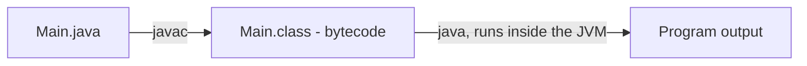
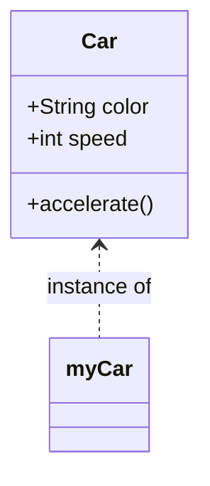
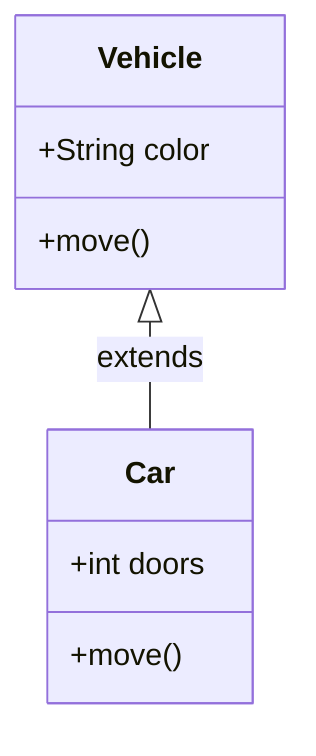

# Java Basics

## What is Java?

Java is a **compiled**, **high-level**, **general-purpose**, **object-oriented** programming language.

- **Compiled**: the source code is transformed into *bytecode* before it runs.
- **Portable**: follows the *"Write Once, Run Anywhere"* principle — the same bytecode runs on any platform that has a JVM.
- **Statically typed**: every variable's type is known at compile time.
- **Automatic memory management**: Java uses a garbage collector, so there's no manual `free`/`delete` like in C/C++.

---

## JVM, JDK, and JRE

### JVM (Java Virtual Machine)
The **virtual machine** that executes Java bytecode. It's what makes Java portable — the same `.class` file runs on any OS that has a JVM.

### JDK (Java Development Kit)
The toolset needed to **develop** in Java. Includes the compiler (`javac`), the JVM, and standard libraries.

### JRE (Java Runtime Environment)
The environment needed to **run** Java programs (JVM + core libraries), without the development tools.

📌 To write and compile code, you need the **JDK**. The JRE alone is only enough to run already-compiled programs.



---

## Compiling and Running

```bash
javac Main.java
java Main
```

- `javac` → compiles the source code into bytecode (`.class` file)
- `java` → runs the compiled program inside the JVM

---

## The Main Class and the `main` Method

### What is `main`?

It's the **entry point** of every Java program — execution always starts here.

```java
public class Main {
    public static void main(String[] args) {
        System.out.println("Hello world");
    }
}
```

📌 Without a `main` method, the program can't start (unless it's a library, not a standalone application).

Breaking down the signature:

- `public` — accessible from outside the class (the JVM needs to call it)
- `static` — belongs to the class itself, no object needs to be created to run it
- `void` — returns nothing
- `String[] args` — command-line arguments passed to the program

---

## Java Naming Conventions

- **camelCase** → variables and methods (`portNumber`, `calculateTotal()`)
- **PascalCase** → classes and interfaces (`UserAccount`, `Runnable`)
- **UPPER_CASE_WITH_UNDERSCORES** → constants

```java
public static final int VERSION_API = 1;
```

---

## Variables and Data Types

### What is a variable?

A variable is a **space in memory** that stores a value.

In Java, the **type must be declared explicitly** (unlike Python or JavaScript).

```java
int port = 80;
String text = "Hello";
```

---

### Primitive Data Types

| Type      | Stores               | Example              |
| --------- | --------------------- | --------------------- |
| `int`     | Whole numbers         | `int age = 27;`       |
| `double`  | Decimal numbers       | `double price = 9.99;`|
| `float`   | Decimal (less precision) | `float rate = 1.5f;` |
| `long`    | Large whole numbers   | `long id = 100000L;`  |
| `boolean` | true / false          | `boolean active = true;` |
| `char`    | A single character    | `char grade = 'A';`   |
| `byte`    | Small integer (-128 to 127) | `byte b = 10;`   |
| `short`   | Small integer range   | `short s = 500;`      |

### Reference Types

Everything that isn't a primitive is a **reference type** — it stores a reference (address) to an object in memory, not the value itself.

- `String` → text
- Arrays
- Any class you create (`Car`, `User`, etc.)

```java
String name = "Isaac";   // String is a class, not a primitive
```

---

### Type Casting (Type Conversion)

#### What is type casting?

Converting one data type into another.

**Widening (implicit)** — safe, done automatically:

```java
int number = 5;
double decimal = number;   // int -> double, no cast needed
```

**Narrowing (explicit)** — needs a cast, and may lose data:

```java
double decimal = 5.9;
int number = (int) decimal;   // 5, the decimal part is discarded
```

Converting between numbers and `String`:

```java
int number = 5;
String text = String.valueOf(number);   // "5"

String value = "42";
int parsed = Integer.parseInt(value);    // 42
```

---

## Arrays

An array is a **fixed-size** collection of elements of the same type.

```java
int[] numbers = {1, 2, 3, 4, 5};
String[] names = new String[3];
names[0] = "Isaac";
```

```java
for (int i = 0; i < numbers.length; i++) {
    System.out.println(numbers[i]);
}
```

Arrays have a fixed size once created — for a growable collection, use `ArrayList`.

---

## Lists (ArrayList)

### What is a list?

A structure that stores **multiple values dynamically** (it can grow or shrink), unlike arrays.

```java
import java.util.ArrayList;

ArrayList<Integer> ports = new ArrayList<>();
ports.add(22);
ports.add(80);
```

### Common list operations

```java
ports.get(0);          // access by index
ports.remove(0);        // remove by index
ports.size();            // number of elements
ports.contains(80);      // check if a value exists
```

### Looping through a list

```java
for (int port : ports) {
    System.out.println(port);
}
```

---

## Maps (HashMap)

A `HashMap` stores **key-value pairs**, similar to a dictionary.

```java
import java.util.HashMap;

HashMap<String, Integer> ages = new HashMap<>();
ages.put("Isaac", 27);
ages.put("Maria", 24);

System.out.println(ages.get("Isaac"));   // 27

for (String key : ages.keySet()) {
    System.out.println(key + " -> " + ages.get(key));
}
```

---

## Basic Operators

### Arithmetic operators

- `+` addition
- `-` subtraction
- `*` multiplication
- `/` division
- `%` modulo (remainder)

```java
int result = 10 * 5;
```

### Comparison operators

- `==` equal (careful: for objects, compares references, not content — use `.equals()`)
- `!=` not equal
- `>` greater than
- `<` less than
- `>=` greater than or equal
- `<=` less than or equal

### Logical operators

- `&&` AND
- `||` OR
- `!` NOT

```java
if (age >= 18 && hasId) {
    System.out.println("Can enter");
}
```

---

## String Formatting

### What is formatting?

Inserting variables inside text.

```java
String name = "Isaac";
int age = 27;

System.out.println(String.format("Hello, I'm %s and I'm %d years old", name, age));
```

Modern alternative — text blocks and concatenation:

```java
System.out.println("Hello, I'm " + name + " and I'm " + age + " years old");
```

Common format specifiers:

| Specifier | Meaning        |
| --------- | -------------- |
| `%s`      | String         |
| `%d`      | Integer        |
| `%f`      | Floating point |
| `%.2f`    | 2 decimal places |
| `%n`      | New line       |

---

## Control Flow

### If / Else

```java
if (age >= 18) {
    System.out.println("Adult");
} else {
    System.out.println("Minor");
}
```

### Switch

```java
switch (day) {
    case 1:
        System.out.println("Monday");
        break;
    case 2:
        System.out.println("Tuesday");
        break;
    default:
        System.out.println("Unknown day");
}
```

Modern switch expression (Java 14+):

```java
String result = switch (day) {
    case 1 -> "Monday";
    case 2 -> "Tuesday";
    default -> "Unknown day";
};
```

### For

```java
for (int i = 0; i < 5; i++) {
    System.out.println(i);
}
```

### Enhanced for (for-each)

```java
for (int number : numbers) {
    System.out.println(number);
}
```

### While

```java
int i = 0;
while (i < 5) {
    i++;
}
```

### Do-While

Runs at least once, since the condition is checked at the end.

```java
int i = 0;
do {
    System.out.println(i);
    i++;
} while (i < 5);
```

### break and continue

```java
for (int i = 0; i < 10; i++) {
    if (i == 5) break;       // exits the loop
    if (i % 2 == 0) continue; // skips this iteration
    System.out.println(i);
}
```

---

## Functions (Methods)

### What is a method?

A method is a **reusable block of code** that belongs to a class.

```java
public static int sum(int a, int b) {
    return a + b;
}
```

### Method overloading

Multiple methods with the **same name** but **different parameters**.

```java
public static int sum(int a, int b) {
    return a + b;
}

public static double sum(double a, double b) {
    return a + b;
}
```

---

## Scope

### What is scope?

Defines **where a variable exists** and where it can be used.

### Local variable

Exists only inside the method where it's declared.

```java
public static void method() {
    int x = 10;
}   // x no longer exists after this
```

### Instance variable (attribute)

Belongs to each object created from the class.

```java
public class Car {
    String color;   // instance variable
}
```

### Class variable (`static`)

Shared by all instances of the class — there's only one copy.

```java
static int counter = 0;
```

---

## Lambda Expressions

### What is a lambda?

An **anonymous function**, mainly used with functional interfaces (interfaces with a single abstract method).

```java
(x) -> x * 2
```

Example with lists:

```java
ports.forEach(p -> System.out.println(p));
```

Example with a functional interface:

```java
import java.util.function.Function;

Function<Integer, Integer> square = x -> x * x;
System.out.println(square.apply(5));   // 25
```

---

## Error Handling and Exceptions

### What is an exception?

An error that can be **handled** so the program doesn't crash.

```java
try {
    int x = 5 / 0;
} catch (ArithmeticException e) {
    System.out.println("Cannot divide by zero");
} finally {
    System.out.println("This always runs");
}
```

### Throwing exceptions

```java
if (x < 0) {
    throw new IllegalArgumentException("Number cannot be negative");
}
```

### Checked vs Unchecked exceptions

- **Checked**: must be declared with `throws` or caught (e.g. `IOException`) — checked at compile time.
- **Unchecked** (`RuntimeException` and subclasses): don't need to be declared (e.g. `NullPointerException`, `ArithmeticException`).

```java
public void readFile() throws IOException {
    // code that might throw a checked exception
}
```

### Custom exceptions

```java
public class InvalidAgeException extends Exception {
    public InvalidAgeException(String message) {
        super(message);
    }
}
```

---

---

# Object-Oriented Programming (OOP) in Java

Java is built around OOP — organizing code into **classes** and **objects** instead of just functions and data. OOP rests on four main pillars: **encapsulation**, **inheritance**, **polymorphism**, and **abstraction**.

---

## Classes and Objects

### What is a class?

A **blueprint/template** that defines the attributes (data) and behavior (methods) that its objects will have.

### What is an object?

An **instance** of a class — an actual entity created from that blueprint, with real values in memory.

```java
public class Car {
    // attributes
    String color;
    int speed;

    // method
    void accelerate() {
        speed += 10;
    }
}
```

```java
Car myCar = new Car();      // creating an object (instance)
myCar.color = "red";
myCar.accelerate();
```



---

## Constructors

### What is a constructor?

A special method used to **initialize objects** when they're created. It has the same name as the class and no return type.

```java
public class Car {
    String color;
    int speed;

    // constructor
    public Car(String color) {
        this.color = color;
        this.speed = 0;
    }
}
```

```java
Car myCar = new Car("blue");
```

### `this` keyword

Refers to the **current object** — commonly used to distinguish between an attribute and a parameter with the same name.

```java
public Car(String color) {
    this.color = color;   // this.color = attribute, color = parameter
}
```

### Constructor overloading

A class can have multiple constructors with different parameters.

```java
public class Car {
    String color;
    int speed;

    public Car() {
        this.color = "white";
        this.speed = 0;
    }

    public Car(String color) {
        this.color = color;
        this.speed = 0;
    }

    public Car(String color, int speed) {
        this.color = color;
        this.speed = speed;
    }
}
```

### Default constructor

If you don't write any constructor, Java automatically provides an empty one. As soon as you write your own constructor, the automatic one disappears.

---

## Encapsulation

### What is encapsulation?

Hiding an object's internal data and only exposing it through **controlled access** (getters and setters). This protects the object's state from invalid changes.

### Access modifiers

| Modifier      | Same class | Same package | Subclass | Other packages |
| ------------- | :--------: | :----------: | :------: | :-------------: |
| `private`     | ✅         | ❌           | ❌       | ❌               |
| *(default)*   | ✅         | ✅           | ❌       | ❌               |
| `protected`   | ✅         | ✅           | ✅       | ❌               |
| `public`      | ✅         | ✅           | ✅       | ✅               |

### Getters and setters

```java
public class Car {
    private String color;   // private: not directly accessible from outside

    public String getColor() {
        return color;
    }

    public void setColor(String color) {
        this.color = color;
    }
}
```

```java
Car myCar = new Car();
myCar.setColor("red");
System.out.println(myCar.getColor());
```

📌 Encapsulation is why attributes are usually `private`, and access is only allowed through public methods — this lets you add validation logic later without breaking code that uses the class.

```java
public void setSpeed(int speed) {
    if (speed >= 0) {
        this.speed = speed;
    } else {
        throw new IllegalArgumentException("Speed cannot be negative");
    }
}
```

---

## Inheritance

### What is inheritance?

Lets a class (**subclass/child**) reuse attributes and methods from another class (**superclass/parent**), using `extends`.

```java
public class Vehicle {
    String color;

    void move() {
        System.out.println("Moving...");
    }
}

public class Car extends Vehicle {
    int doors;
}
```

```java
Car myCar = new Car();
myCar.color = "red";   // inherited from Vehicle
myCar.move();            // inherited from Vehicle
```

### `super` keyword

Refers to the **parent class** — used to call its constructor or methods.

```java
public class Vehicle {
    String color;

    public Vehicle(String color) {
        this.color = color;
    }
}

public class Car extends Vehicle {
    int doors;

    public Car(String color, int doors) {
        super(color);       // calls the parent constructor
        this.doors = doors;
    }
}
```

### Method overriding

A subclass can **redefine** a method inherited from its parent, using the `@Override` annotation.

```java
public class Vehicle {
    void move() {
        System.out.println("The vehicle is moving");
    }
}

public class Car extends Vehicle {
    @Override
    void move() {
        System.out.println("The car is driving");
    }
}
```

📌 Java only supports **single inheritance** for classes (a class can only `extends` one other class), but a class can implement **multiple interfaces**.



---

## Polymorphism

### What is polymorphism?

The ability of an object to take **many forms** — the same method call can behave differently depending on the actual object type.

### Runtime polymorphism (method overriding)

```java
Vehicle myVehicle = new Car();   // a Car referenced as a Vehicle
myVehicle.move();                  // runs Car's version of move()
```

This is possible because Java decides *which* version of `move()` to run at runtime, based on the object's real type — not the reference type.

### Compile-time polymorphism (method overloading)

Already covered above — multiple methods with the same name but different parameters, resolved at compile time.

### Example with a list of different subtypes

```java
ArrayList<Vehicle> vehicles = new ArrayList<>();
vehicles.add(new Car());
vehicles.add(new Motorcycle());

for (Vehicle v : vehicles) {
    v.move();   // each one runs its own version of move()
}
```

---

## Abstraction

### What is abstraction?

Hiding complex implementation details and exposing only the **essential behavior**. In Java it's achieved with **abstract classes** and **interfaces**.

### Abstract classes

Can't be instantiated directly, and can contain both abstract methods (no body) and regular methods.

```java
public abstract class Vehicle {
    String color;

    abstract void move();   // no implementation — subclasses must provide one

    void honk() {
        System.out.println("Beep beep!");
    }
}

public class Car extends Vehicle {
    @Override
    void move() {
        System.out.println("The car is driving");
    }
}
```

```java
Vehicle v = new Vehicle();   // ❌ compile error, can't instantiate an abstract class
Vehicle v = new Car();        // ✅ valid
```

### Interfaces

A contract that defines **what** a class must do, without saying **how**. A class uses `implements` to fulfill an interface.

```java
public interface Movable {
    void move();
}

public class Car implements Movable {
    @Override
    public void move() {
        System.out.println("The car is driving");
    }
}
```

A class can implement **multiple interfaces**:

```java
public class Car implements Movable, Refuelable {
    // must implement all methods from both interfaces
}
```

### Abstract class vs Interface

| Abstract class                          | Interface                                   |
| ---------------------------------------- | -------------------------------------------- |
| Can have state (attributes)             | Traditionally no state (only constants)      |
| Can have constructors                    | Cannot have constructors                     |
| Single inheritance (`extends` one class) | Multiple implementation (`implements` many)  |
| Can mix abstract and concrete methods    | Can have default methods (Java 8+) and abstract methods |
| Use when classes share a common base and some shared code | Use to define a capability/contract across unrelated classes |

---

## Static vs Instance Members

### Instance members

Belong to each **object** — every object has its own copy.

```java
public class Car {
    String color;   // instance attribute
}
```

### Static members

Belong to the **class itself** — shared by all objects, only one copy exists.

```java
public class Car {
    static int totalCars = 0;   // shared counter

    public Car() {
        totalCars++;
    }
}
```

```java
Car car1 = new Car();
Car car2 = new Car();
System.out.println(Car.totalCars);   // 2
```

📌 Static methods can't access instance attributes directly, since they don't belong to a specific object — that's why `main` (which is `static`) can't directly use instance variables.

---

## `equals()`, `hashCode()`, and `toString()`

### `toString()`

Defines how an object is represented as text (used automatically by `println`, string concatenation, etc.).

```java
public class Car {
    String color;

    @Override
    public String toString() {
        return "Car[color=" + color + "]";
    }
}
```

### `equals()`

By default, `==` and `.equals()` compare **references** (memory addresses), not content. Override `equals()` to compare by actual data.

```java
@Override
public boolean equals(Object obj) {
    if (this == obj) return true;
    if (!(obj instanceof Car)) return false;
    Car other = (Car) obj;
    return this.color.equals(other.color);
}
```

📌 Whenever you override `equals()`, you should also override `hashCode()`, since collections like `HashMap` and `HashSet` rely on both being consistent with each other.

---

## Packages

### What is a package?

A way to **organize classes** into namespaces/folders, and to avoid naming conflicts.

```java
package com.example.myapp;

public class Car {
    // ...
}
```

Importing a class from another package:

```java
import com.example.myapp.Car;
```

---

## Object-Oriented Design — Quick Checklist

* Class vs object — blueprint vs instance
* Constructors, constructor overloading, `this`
* Encapsulation — `private` fields, getters/setters, access modifiers
* Inheritance — `extends`, `super`, method overriding
* Polymorphism — runtime (overriding) vs compile-time (overloading)
* Abstraction — abstract classes vs interfaces
* Static vs instance members
* `equals()`, `hashCode()`, `toString()`
* Packages and imports
* Checked vs unchecked exceptions, custom exceptions

---

## Full Example — Putting It All Together

```java
package com.example.vehicles;

public abstract class Vehicle {
    protected String color;
    protected static int totalVehicles = 0;

    public Vehicle(String color) {
        this.color = color;
        totalVehicles++;
    }

    abstract void move();

    public String getColor() {
        return color;
    }

    @Override
    public String toString() {
        return this.getClass().getSimpleName() + "[color=" + color + "]";
    }
}

public class Car extends Vehicle {
    private int doors;

    public Car(String color, int doors) {
        super(color);
        this.doors = doors;
    }

    @Override
    void move() {
        System.out.println("The car is driving on 4 wheels");
    }
}

public class Motorcycle extends Vehicle {
    public Motorcycle(String color) {
        super(color);
    }

    @Override
    void move() {
        System.out.println("The motorcycle is riding on 2 wheels");
    }
}

public class Main {
    public static void main(String[] args) {
        Vehicle car = new Car("red", 4);
        Vehicle motorcycle = new Motorcycle("black");

        car.move();
        motorcycle.move();

        System.out.println(car);
        System.out.println("Total vehicles created: " + Vehicle.totalVehicles);
    }
}
```

This example ties together: **abstraction** (`Vehicle` is abstract), **inheritance** (`Car` and `Motorcycle` extend `Vehicle`), **polymorphism** (both are called through a `Vehicle` reference but each runs its own `move()`), **encapsulation** (`private` fields with controlled access), and **static** members (`totalVehicles` shared across all instances).